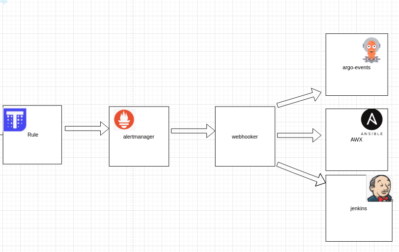

### This project wrriten in order to get alertmanager event and send webhooks acorrdinaly 

## prometheus/ thanos_rule rule
```
  - alert: example_alert_awx
    expr: job:request_latency_seconds:mean5m{job="myjob"} > 0.5
    for: 5m
    labels:
      severity: P3
    annotations:
      alertname: example_alert_awx
      summary: "example_alert_awx"
      description: "example_alert_awx"


## alertmanager config example:
'''

```
receivers:
- name: webhooker_opsgenie
  opsgenie_configs:
  - api_key: OPSGENIE_API_KEY
    send_resolved: true
    priority: 'P3'
  webhook_configs:
  - url: 'http://webhookerurl.com:5000/postjson'
    send_resolved: true
```





in our case it will triggers awx templates

### how to run
docker run --name=mysql-webhooker  --env=MYSQL_ROOT_PASSWORD=****  --network=host -p 0.0.0.0:3306:3306 --restart=on-failure --log-opt max-size=100m  --detach=true mysql:5.7 mysqld

docker build . -t your_docker_image

docker run  -e smtp_username=**** -e smtp_password=**** -e awx_username=***** -e awx_password=****  -e mysql_password=**** jenkins_token=****  your_docker_image

### how to change configuration

change config.yaml 

### Awx URL var
url: "https://awx-example-url.com/api/v2/job_templates/43/launch/"

refrence : 
https://docs.ansible.com/ansible-tower/3.2.6/html/towerapi/launch_jobtemplate.html

### Alertmanager alerts 
limit:
 ## alert name
 sin_mirror:  ''' {"limit": "sin-mirror-maker","extra_vars": {"command": "start","kafka_cluster_name": "kafka-etl-9"} '''

### UI with some info such as alert configuartion 

http://your_host:5000/


### how to test it

curl -vX POST http://127.0.0.1:5000/postjson  --header "Content-Type: application/json" -d @test.json


###json example
```
{
	"receiver": "webhooker_opsgenie",
	"status": "firing",
	"alerts": [{
		"status": "firing",
		"labels": {
			"alertname": "file_transfer",
			"instance": "was-example-sdp5.stapp.com:8004",
			"severity": "p2",
			"team": "sdp_autohealing"
		},
		"annotations": {
			"alertname": "file_transfer",
			"description": "there are files older than 70 minutes",
			"instance": "was-example-sdp5.stapp.com:8004",
			"summary": "file transfer alert"
		},
		"startsAt": "2020-03-19T08:31:33.027000593Z",
		"endsAt": "0001-01-01T00:00:00Z"

	}],
	"groupLabels": {
		"alertname": "file_transfer",
		"instance": "was-example-sdp5.stapp.com:8004"
	},
	"commonLabels": {
		"alertname": "file_transfer",
		"instance": "was-example-sdp5.stapp.com:8004",
		"severity": "p2",
		"team": "sdp_autohealing"
	},
	"commonAnnotations": {
		"alertname": "file_transfer",
		"description": "there are files older than 70 minutes",
		"instance": "was-example-sdp5.stapp.com:8004",
		"summary": "file transfer alert"
	}

}
```

## for debugging purpose 

http://webhooker-url.com:5000/

* at the top of the page you will see 500 last trigger alerts 


* at the buttom of the page you can see the last 20 json alerts who sent from alertmanager 


TODO:

* add docker-compose file
* add helm charts 